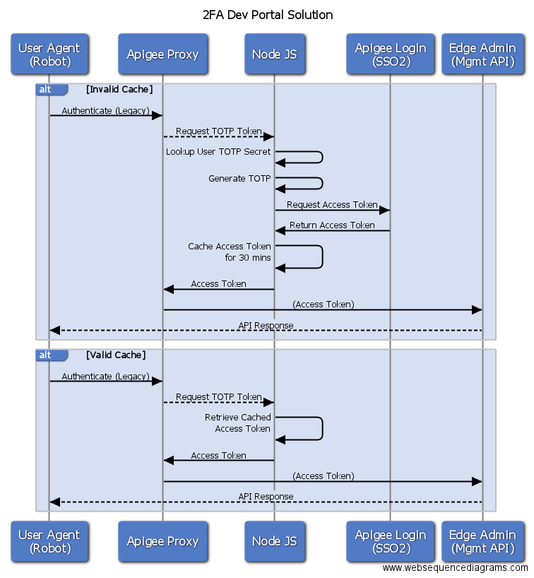

# TOTP Generator Proxy
## Enabling Management API calls for Machine Users in an org with Two-Factor Authentication enabled.

When two-factor authentication is enabled for an organization, then all users
will be required to provide a one-time password when logging into [Apigee Edge
UI](http://docs.apigee.com/api-services/content/enable-two-factor-auth-your-apigee-account).
Additionally, Basic Authentication is disabled for the management APIs, and
OAuth2 can be used in conjunction with the time-based on time password instead.
Human users will use an app such as [Google Authenticator](https://support.google.com/accounts/answer/1066447?hl=en) to generate one-time
passwords, however machine users such as Continuous Integration systems of the
Developer Portal will need to use a different mechanism to generate this
password. One approach is to proxy the existing Basic Auth Management API calls
and dynamically generate the one-time password and access token before passing
to the Apigee Management API.

## High Level Design



- This Apigee Proxy only needs to be deployed in a single environment

## Prerequisites
- [Maven](https://maven.apache.org/) for deployment
- [Node JS](https://nodejs.org/en/) and [CucumberJS](https://github.com/cucumber/cucumber-js) to run the tests
- [Git](https://git-scm.com/) to clone this repository

## Create Environment Entities
### Key Value Maps
- Create an environment [key value map](http://docs.apigee.com/management/apis/post/organizations/%7Borg_name%7D/environments/%7Benv_name%7D/keyvaluemaps) named `mfaConfig`
- Create an [entry](http://docs.apigee.com/management/apis/post/organizations/%7Borg_name%7D/environments/%7Benv_name%7D/keyvaluemaps/%7Bmap_name%7D/entries) in this KVM called `mfaConfig` with the following JSON string
```
mfaConfig: {"totpCreds":"ZWRnZWNsaTplZGdlY2xpc2VjcmV0 ", "totpKey":"(Secret key for TOTP)", "devPortalUser":"(robot email)", "mgmtUrl":"https://api.enterprise.apigee.com/v1"}	
```
If you know the secret key and email of your robot user, add them in this payload. If you do not know the credentials, you can update them later. See (Determining Dev Portal Credentials) for more. Please note that developer portal usernames are in the form `devadmin+(orgname)@apigee.com`.

### Caches
- Create an [environment cache](docs.apigee.com/management/apis/post/organizations/%7Borg_name%7D/environments/%7Benv_name%7D/caches) named `mfaConfig`. This will be used cache the JSON configuration in the KVM map. A recommended expiry time would be 30 mins.
- Create an [environment cache](docs.apigee.com/management/apis/post/organizations/%7Borg_name%7D/environments/%7Benv_name%7D/caches) named `robotMgmtProxy`. This will be used cache the access token generated. The expiry of this cache should match the life of the access token for the management API (default is 30mins).

## Deploy the Proxy
- Determine which maven profile you need to use for deployment. If you are a cloud customer, then you can use `deploy` if you currently use basic auth to make management API calls. If you have already enabled two-factor authentication, you can use `deploy-mfa` and provide your mfatoken as a parameter. On premise customers should create a new profile in `pom.xml` that sets `apigee.hosturl` to the correct management API host.

Basic Auth example:
```
mvn install -Pdeploy -Dorganization=(myorg) -Dusername=(myemail) -Dpassword=(mypassword) -Denv=(myenv)
```

Two-factor auth example:
```
mvn install -Pdeploy-mfa -Dorganization=(myorg) -Dusername=(myemail) -Dpassword=(mypassword) -Dmfatoken=(myonetimepassword) -Denv=(myenv)
```

## Populate the Test Data
- Navigate to `tests/integration/step_definitions/init-tests.js`
- Set the `url` variable to be the URL of the proxy you have just deployed.
- Set the `robotUsername` and `robotPassword` to the robot's credentials. Please see (Determining Dev Portal Credentials) if required.
- Set the `humanUsername` and `humanPassword` to some valid, known credentials. These will be used to test that human users cannot log in with their basic auth credentials.
- Set the `orgName` to the name of your organization. 

## Robot Management URL Change
Now that the proxy is deployed, you are ready to enable two-factor authentication in the environment and ensure your robots are using the new proxy.
### Developer Portal
- Enable Two Factor Authentication in the Organization - cloud customers will need to raise a support ticket for this.
- Switch the Management API URL used by the Developer Portal - cloud customers will need to raise a support ticket for this. On premise customers and administrators will use drush to change this url. 

Example Pantheon Drush command:
```
terminus drush "dc-setend https://(Apigee url to new proxy)" --site=(site name) --env=(env)
```

### Other tools inc. Continuous Integration
- Switch the URL from the management API to the new proxy URL.
- Ensure the credentials match those used in mfaConfig KVM.

## Set up two-factor authentication for main user
- Log in to the Apigee UI using the robot users credentials. If you don't know the Dev Portal credentials see below.
- Navigate to `https://accounts2.apigee.com/accounts/my_account` and click *Configure Two Factor Authentication*
- Instead of using Google Authenticator, click "Unable to Scan Barcode?" and copy the key that is shown on screen.
- Use this code to obtain the six-digit totp code to complete the step. You can use nodejs apps such as this [tool](http://jsfiddle.net/russau/ch8PK/) or totp-generator](https://www.npmjs.com/package/totp-generator) to obtain the totp code.

## Update config
* You can now update the `mfaConfig` key value map. Set $.totpKey to the key that was obtained on step 3 above.

## Clear caches
* As `mfaConfig` key value map has been updated, you can now clear the `mfaConfig` cache to use the latest configuration.

## Test
- For developer portals, a quick smoke test can be performed at this point. Log into your Developer Portal as an Administrator and select Configuration -> Dev Portal. The *Connection Status* section will indicate whether the Developer Portal was able to successfully make a management API call through your proxy.
- The Cucumber tests can now be run to ensure everything was configured correctly. If you have cucumber installed globally, run `cucumber-js tests/integration/` from the project root. These tests will indicate whether you have been successful in configuring this proxy.

## Determining Dev Portal Credentials
* Requests between the Dev Portal and the Management APIs use a 'Dev Admin' [user's credentials].(https://community.apigee.com/questions/29349/what-is-developer-administrator-role-in-apigee-edg.html). You can obtain these credentials by either contacting support, or tracing the proxy deployed in the *Robot Management URL Change* step above. Alternatively, you can create a pass-through proxy, and switch the developer portal to use that URL and observe the Basic Auth credentials it uses.

## Seamless deployment
* In order to deploy this solution without downtime, you must obtain the Dev Admin credentials in advance (*Determining Dev Portal Credentials* above) and can use the *override* [maven deploy](https://github.com/apigee/apigee-deploy-maven-plugin) option.
* You should consider deploying this in a nonprod org first, where seamless deployment is not required in order to understand the process.

## Considerations
- You can consider using the Encrypted KVM and Role Based Access Control to restrict access to the MFA Configuration if required within your org.